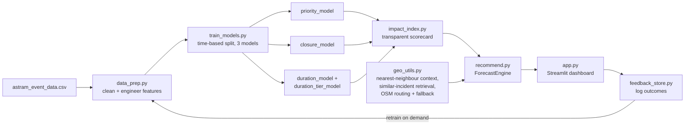

# 🚦 ASTraM Event Impact Forecaster

**Gridlock Hackathon 2.0 — Theme: Event-Driven Congestion (Planned & Unplanned)**

Forecasts the traffic impact of an upcoming or just-reported event in Bengaluru and
recommends manpower, barricading, and diversion plans — learned from 8,000+ real
ASTraM/Bengaluru Traffic Police incident records, not assumptions.

> *"How can historical and real-time data be used to forecast event-related traffic
> impact and recommend optimal manpower, barricading, and diversion plans?"*
> — problem statement brief

## Why this approach

The brief names three concrete failures: impact isn't quantified in advance,
resource deployment is experience-driven, and there's no post-event learning
system. This project targets each one directly instead of generically "applying
ML to the dataset":

1. **Quantifying impact in advance** → a transparent **Impact Index (0–100)**
   combining a validated road-closure probability model, an expected-duration
   estimate, and corridor/priority context — see `src/impact_index.py`.
2. **Making deployment data-informed instead of purely experience-driven** → a
   manpower/barricade/diversion recommendation engine in `src/recommend.py` whose
   assumptions are explicit, named constants rather than a buried black box.
3. **Closing the learning loop** → a feedback tab where ops log what actually
   happened, which feeds straight back into retraining (`src/feedback_store.py`).

Everything runs on **free, open tooling only**: scikit-learn, pandas, Streamlit,
Plotly, and OpenStreetMap. No paid API keys are required to run or deploy this.

## What it looks like

- **Command Center** — hotspot map, time-of-day/day-of-week patterns, and the
  highest-risk corridors, straight from the historical data.
- **Forecast & Plan** — describe a new event (cause, location, time) and get an
  Impact Index, road-closure probability, expected-duration outlook, recommended
  personnel count, barricade points, suggested diversion routes, and the actual
  similar past incidents the forecast is grounded in. Location can be set by
  typing a place name (free OpenStreetMap geocoding), picking a known hotspot,
  or entering coordinates directly — and the recommended personnel/barricades
  are plotted on an actual deployment map, snapped to the nearest real
  junction's actual approach roads when live OSM data is available (falling
  back to an evenly-spaced ring otherwise), not just shown as numbers.
- **Feedback Loop** — log a resolved event's real outcome and retrain on demand.
- **Model Insights** — honest, time-based-holdout metrics and methodology notes.

## Quickstart

```bash
git clone <this-repo>
cd gridlock
pip install -r requirements.txt
python src/train_models.py     # trains & saves models (~10 seconds)
streamlit run app.py
```

Open the URL Streamlit prints (usually `http://localhost:8501`).

### Run the test suite

```bash
python tests/test_pipeline.py        # no extra dependencies needed
# or, if you have pytest:
pip install pytest && pytest tests/ -v
```

## Deploying for free (for the live judging demo)

1. Push this repo to GitHub (public or private).
2. Go to [share.streamlit.io](https://share.streamlit.io) (Streamlit Community
   Cloud, free tier), sign in with GitHub, click **New app**, point it at this
   repo and `app.py`.
3. Streamlit Cloud installs `requirements.txt` and runs the app automatically.
   Models are trained at build time if `models/*.joblib` aren't committed, or
   commit them directly (see `.gitignore` notes) to skip that step.

No credit card, no API keys, no server to manage.

## Architecture



| File | Responsibility |
|---|---|
| `src/data_prep.py` | Loads the raw export, parses timestamps to IST, engineers time/spatial/festival features, KMeans geo-clusters for spatial generalisation. |
| `src/features.py` | Single source of truth for which columns feed each model and how they're preprocessed. |
| `src/train_models.py` | Trains + evaluates priority / road-closure / duration models on a **time-based** holdout; saves artifacts + honest metrics. |
| `src/impact_index.py` | Combines model outputs into a documented, configurable 0–100 severity score — not a 4th black-box model. |
| `src/geo_utils.py` | Nearest-context lookup, similar-incident (precedent) retrieval, optional live OSM diversion routing with automatic offline fallback, free Nominatim geocoding (type a place name instead of coordinates), and deployment-point geometry (turns a manpower/barricade count into actual map positions). |
| `src/recommend.py` | The `ForecastEngine` — manpower/barricade/diversion recommendation logic, ties everything together for the app. |
| `src/feedback_store.py` | Post-event outcome logging + dataset augmentation for retraining. |
| `app.py` | The Streamlit dashboard (4 tabs, described above). |
| `tests/test_pipeline.py` | Regression tests, including one for a real bug found during development (see below). |

## What the data actually shows (and a bug worth knowing about)

- **`priority` is ~99.8% determined by corridor membership alone** — incidents on
  a named arterial corridor get tagged High, everything else Low, almost without
  exception, regardless of cause, time, or actual disruption length. This *is*
  the "impact not quantified in advance" gap from the brief, made visible — see
  the Command Center tab.
- **Road-closure probability is genuinely learnable** from cause + location +
  time (time-based holdout ROC-AUC ≈ 0.84, PR-AUC ≈ 4.6× the ~8.7% base rate).
- **Duration is hard.** Only ~36% of events have a resolvable duration, and it's
  extremely heavy-tailed. A regularised regressor barely beats a naive median
  baseline on unseen future weeks. Rather than oversell a shaky point estimate,
  the app leads with a 3-tier probability distribution (Quick/Moderate/
  Prolonged) and **retrieved similar past incidents with their real outcomes** —
  more honest and, for an ops audience, more actionable than a falsely precise
  number.
- **Regression test worth reading**: `tests/test_pipeline.py::test_mixed_datetime_formats_do_not_silently_drop_rows`.
  During development, mixing the original export's timestamp format with the
  feedback loop's ISO timestamps caused pandas to silently coerce ~1.4% of rows
  (and, transiently, every feedback row) to `NaT` and drop them — fixed with
  `format="mixed"` in `data_prep.py`. Recovering those rows alone improved the
  closure model's PR-AUC from 0.30 to 0.40.

All numbers above are reproduced in `models/metrics.json` after running
`train_models.py`, and in the app's **Model Insights** tab.

## Calibrating the recommendation engine with real BTP data

`src/recommend.py` has two openly-stated, tunable pieces (deliberately not
presented as learned from data the export doesn't contain):

- `BASE_PERSONNEL` — starting personnel-per-cause assumptions.
- `recommend_barricades()` thresholds.

Once real deployment logs (actual headcount per incident, actual barricade
counts) are available — including through the feedback loop — these constants
should be refit against that ground truth instead of left as documented
assumptions. The architecture is built so that's a config change, not a
rewrite.

## Extending this

- **Live OSM diversion routing + road-aware deployment placement**: install
  `osmnx` + `networkx` (see `requirements.txt`) and both
  `geo_utils.get_diversion_suggestion()` and `geo_utils.compute_deployment_points()`
  automatically switch from their offline approximations to live road-network
  data - no code changes needed. Deployment placement in particular gets
  noticeably better: barricades follow the actual bearings of the nearest
  real junction's connecting roads instead of an evenly-spaced ring, so a
  T-junction, a 4-way crossroads, and a roundabout each produce visibly
  different, road-grounded layouts instead of the same generic pattern.
- **MapmyIndia integration**: ASTraM/Gridlock partners with MapmyIndia; if API
  access is available to your team, it's a drop-in replacement inside
  `geo_utils.py` for richer routing/geocoding than the free OSM path.
- **Real-time feed**: the "unplanned" path in the Forecast tab is already
  designed to be called the instant an incident is reported (rather than days
  in advance like a planned event) — wiring it to a live ASTraM feed instead of
  manual entry is a matter of calling `ForecastEngine.forecast()` from an
  ingestion service instead of the Streamlit form.

## Data

`data/astram_event_data.csv` — anonymized ASTraM event export, Bengaluru,
Nov 2023–Apr 2024, 8,173 records, as provided for Gridlock Hackathon 2.0 Phase 2.
